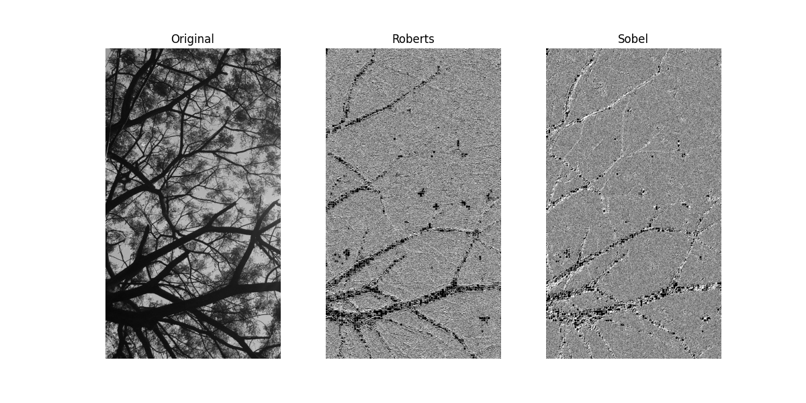
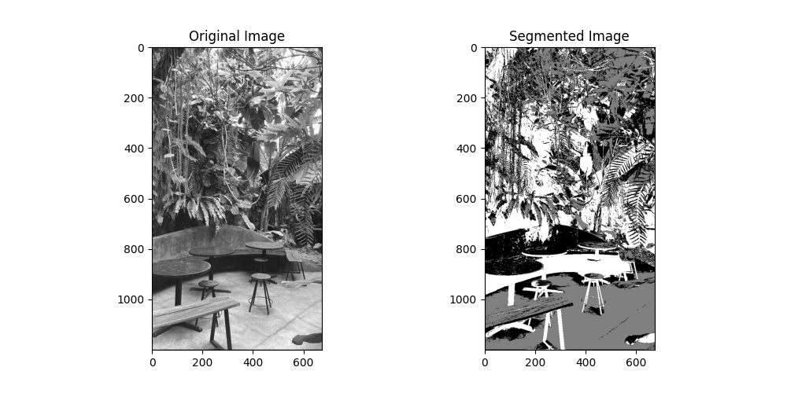

# Informasi Mata Kuliah

Berikut adalah informasi terkait mata kuliah yang diambil:

| Keterangan        | Detail                                 |
|-------------------|----------------------------------------|
| **Mata Kuliah**    | Pengolahan Citra Digital               |
| **Kelas**          | IFD51                                  |
| **Prodi**          | S1 PJJ Informatika                     |
| **Nama Mahasiswa** | Ahmad Fatoni                           |
| **NIM**            | 200401010148                           |
| **Dosen**          | Alun Sujjada, S.Kom., M.T              |

---

# Jawaban UAS_Pengolahan Citra_IFD51
## 1. Deteksi Tepi dengan Menggunakan Model Roberts dan Operator Sobel

Gambar ini menunjukkan proses deteksi tepi menggunakan dua metode, yaitu **Roberts** dan **Sobel**, yang keduanya merupakan teknik dalam pemrosesan citra untuk mengekstrak informasi tepi dari suatu gambar grayscale.

### a. Gambar Original (Citra Asli)

Gambar asli menampilkan siluet pohon dengan banyak cabang bercabang, yang menciptakan tantangan dalam deteksi tepi karena adanya variasi intensitas dan detail halus dalam struktur objek. Metode yang digunakan harus cukup sensitif terhadap perubahan halus dalam intensitas gambar untuk menghasilkan deteksi tepi yang optimal.

### b. Hasil dengan Operator Roberts

Hasil deteksi tepi menggunakan operator **Roberts** terlihat pada gambar kedua. Operator ini bekerja dengan menghitung perbedaan intensitas piksel dalam arah diagonal menggunakan filter konvolusi 2x2. 

- Metode ini menghasilkan tepi yang tajam dan tipis, namun dengan banyak noise berupa bintik-bintik kecil.
- Sensitivitas tinggi terhadap perubahan kecil dalam intensitas gambar menyebabkan beberapa detail mungkin hilang atau terganggu oleh noise.
- Kurang optimal untuk gambar dengan tekstur kompleks seperti cabang-cabang pohon yang halus.

### c. Hasil dengan Operator Sobel

Gambar ketiga menunjukkan hasil deteksi tepi menggunakan operator **Sobel**. Berbeda dengan Roberts, metode Sobel menghitung gradien intensitas dalam dua arah utama, yaitu **horizontal dan vertikal**, dengan menggunakan filter konvolusi 3x3.

- Hasil deteksi tepi lebih halus dan lebih jelas dibandingkan dengan metode Roberts.
- Noise yang muncul lebih sedikit, sehingga garis-garis tepi tampak lebih menyatu dan lebih mudah diidentifikasi.
- Karena menangkap perubahan intensitas dalam dua arah, metode ini lebih efektif untuk gambar dengan struktur kompleks dan perubahan gradien yang lebih lembut.

## Kesimpulan

Dari perbandingan kedua metode ini, dapat disimpulkan bahwa:

- **Roberts** lebih cocok untuk gambar dengan perubahan intensitas yang tajam dan kontras tinggi.
- **Sobel** lebih baik untuk menangkap tepi pada gambar dengan variasi intensitas yang lebih kompleks.
- Dalam kasus gambar pohon ini, metode **Sobel lebih direkomendasikan** karena memberikan hasil deteksi tepi yang lebih bersih, lebih halus, dan lebih sedikit noise, sehingga lebih sesuai untuk objek dengan banyak detail seperti cabang-cabang pohon yang saling bertumpuk.

## Perbandingan Operator Roberts dan Sobel

Tabel berikut membandingkan dua operator deteksi tepi: **Roberts** dan **Sobel**.

| Kriteria | Operator Roberts | Operator Sobel |
|----------|-----------------|---------------|
| **Ketajaman Tepi** | Tinggi (tepi tipis) | Sedang (tepi lebih halus) |
| **Sensitif terhadap noise** | Sangat sensitif (banyak noise) | Lebih tahan terhadap noise |
| **Ketahanan terhadap perubahan intensitas halus** | Kurang baik (kehilangan detail kecil) | Baik (menangkap variasi intensitas) |
| **Cocok untuk gambar** | Dengan tepi tajam dan perubahan kontras yang ekstrem | Dengan gradien kompleks dan objek dengan struktur detail |

## 2. Segmentasi Citra Berbasis Clustering dengan K-Means

Segmentasi citra adalah proses pemisahan suatu gambar menjadi beberapa bagian yang lebih bermakna untuk analisis lebih lanjut. Salah satu metode yang banyak digunakan dalam segmentasi citra adalah segmentasi berbasis clustering, yang bekerja dengan cara mengelompokkan piksel berdasarkan kemiripan fitur tertentu, seperti intensitas, warna, atau tekstur. Teknik ini memungkinkan gambar dibagi menjadi beberapa area yang memiliki karakteristik serupa sehingga mempermudah proses identifikasi objek atau pola dalam citra.

Salah satu algoritma clustering yang sering diterapkan dalam segmentasi citra adalah K-Means. Algoritma ini merupakan teknik pembelajaran tanpa pengawasan (unsupervised learning) yang membagi data ke dalam K kelompok berdasarkan kesamaan fitur. Dalam konteks pengolahan citra, setiap piksel direpresentasikan sebagai titik dalam ruang fitur, di mana fitur tersebut bisa berupa nilai intensitas (untuk gambar grayscale) atau vektor warna RGB (untuk gambar berwarna). Algoritma K-Means kemudian mengelompokkan piksel-piksel tersebut ke dalam K cluster yang ditentukan sebelumnya.

Proses kerja K-Means dalam segmentasi citra diawali dengan menentukan jumlah cluster K yang akan digunakan. Pemilihan nilai K sangat penting karena menentukan seberapa banyak kelompok yang akan terbentuk dalam citra. Setelah itu, algoritma akan memilih K titik sebagai centroid awal, yang merupakan pusat dari masing-masing cluster. Setiap piksel dalam gambar kemudian dihitung jaraknya ke setiap centroid menggunakan jarak Euclidean, dan piksel akan dikelompokkan ke dalam cluster dengan centroid terdekat. Setelah semua piksel dikelompokkan, centroid akan diperbarui dengan menghitung rata-rata posisi piksel dalam setiap cluster. Proses ini berulang hingga nilai centroid tidak berubah lagi atau mencapai kondisi konvergensi.

Hasil dari segmentasi dengan K-Means adalah citra yang terbagi menjadi K area berbeda, di mana setiap area mewakili kelompok piksel dengan karakteristik serupa. Metode ini sangat efektif dalam segmentasi warna dan intensitas, sehingga sering digunakan dalam berbagai bidang, seperti pengolahan citra medis untuk membedakan area tumor dari jaringan sehat, analisis citra satelit untuk memisahkan area lahan, air, dan bangunan, serta dalam computer vision untuk menyederhanakan gambar sebelum dilakukan deteksi objek lebih lanjut.

Meskipun memiliki banyak keuntungan, K-Means juga memiliki beberapa kelemahan. Salah satunya adalah harus menentukan jumlah K terlebih dahulu, yang tidak selalu mudah dilakukan tanpa percobaan atau analisis lebih lanjut. Selain itu, algoritma ini juga peka terhadap inisialisasi centroid awal, sehingga hasil segmentasi bisa berbeda setiap kali algoritma dijalankan. Pada gambar dengan variasi kompleks atau gradien halus, K-Means mungkin tidak memberikan segmentasi yang optimal karena hanya mengandalkan kesamaan warna atau intensitas tanpa mempertimbangkan konteks spasial dalam citra.

Dengan memahami prinsip dasar dan cara kerja K-Means, kita dapat menggunakannya secara efektif dalam berbagai aplikasi segmentasi citra. Implementasi algoritma ini dalam bahasa pemrograman Python dapat dilakukan menggunakan pustaka scikit-learn, yang menyediakan fungsi KMeans untuk membagi piksel citra ke dalam beberapa kelompok secara otomatis.

### Berikut hasil gambar segmentasi citra berbasis clustering dengan K-Means

Gambar ini menunjukkan hasil segmentasi citra berbasis clustering menggunakan algoritma K-Means. Pada bagian kiri, terdapat citra asli dalam format grayscale yang menampilkan sebuah lingkungan dengan elemen-elemen alam seperti tanaman serta elemen buatan seperti meja dan kursi. Sedangkan pada bagian kanan, terdapat hasil segmentasi citra, di mana berbagai area gambar telah dikelompokkan ke dalam beberapa cluster berdasarkan kemiripan intensitas pikselnya.

Proses segmentasi dengan K-Means Clustering bertujuan untuk mengelompokkan piksel dengan karakteristik serupa ke dalam sejumlah k kelompok. Pada gambar ini, terlihat bahwa berbagai bagian dari citra asli telah dikelompokkan ke dalam beberapa area berbeda. Misalnya, latar belakang yang terang (seperti area dengan cahaya yang lebih tinggi) diklasifikasikan ke dalam satu cluster, sedangkan bagian dengan bayangan atau objek lebih gelap dikelompokkan ke dalam cluster lain.

Dari hasil segmentasi, terlihat bahwa metode K-Means cukup efektif dalam memisahkan area dengan perbedaan signifikan dalam intensitas cahaya dan tekstur. Daerah dengan dedaunan dan tanaman memiliki variasi segmentasi yang lebih kompleks, menunjukkan bahwa ada banyak perubahan intensitas yang dideteksi. Sementara itu, bagian benda-benda buatan seperti meja dan kursi tampak lebih seragam, karena memiliki pola intensitas yang lebih konsisten dibandingkan dengan elemen alami.

Namun, terdapat beberapa keterbatasan dalam hasil segmentasi ini. Salah satunya adalah munculnya efek segmentasi yang kasar, di mana beberapa bagian gambar tampak mengalami kehilangan detail karena piksel yang sebelumnya memiliki gradien halus kini diklasifikasikan secara kaku ke dalam kelompok tertentu. Hal ini bisa terjadi karena K-Means tidak mempertimbangkan aspek spasial atau kontinuitas objek, sehingga terkadang menghasilkan segmentasi yang terputus-putus atau berbintik-bintik, terutama di daerah dengan banyak detail kecil seperti dedaunan.

Secara keseluruhan, segmentasi berbasis K-Means ini berguna untuk pemrosesan gambar dengan kebutuhan pengelompokan area berdasarkan intensitas atau warna, seperti dalam analisis citra medis, pengenalan objek, atau klasifikasi area dalam citra satelit. Namun, untuk meningkatkan kualitas segmentasi, bisa dilakukan pendekatan tambahan seperti preprocessing dengan smoothing, penggunaan metode berbasis spasial, atau meningkatkan jumlah cluster untuk menangkap lebih banyak variasi dalam citra.